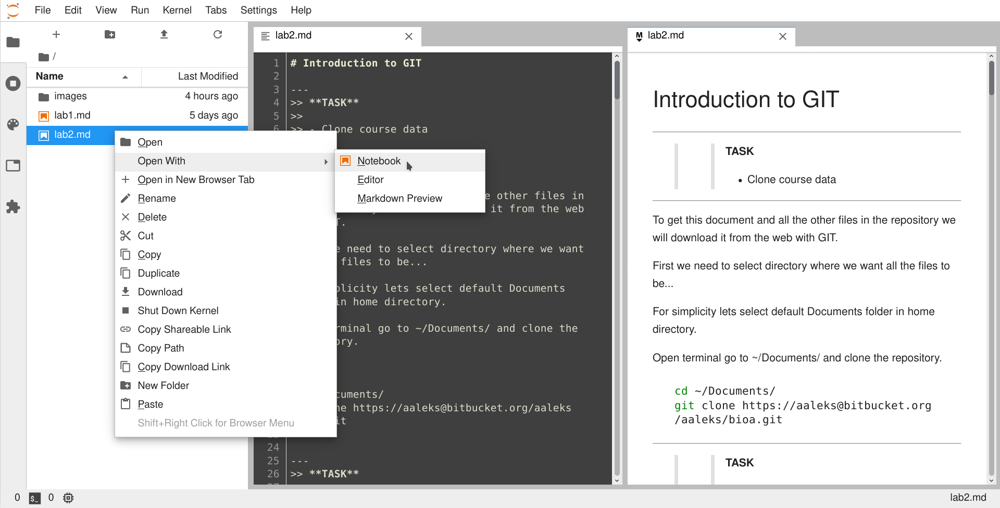
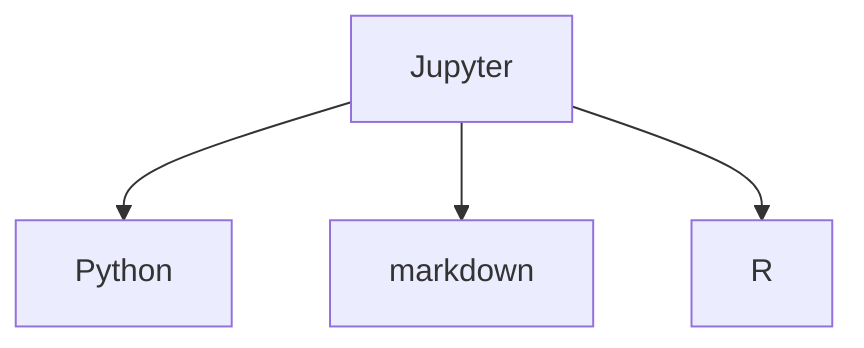
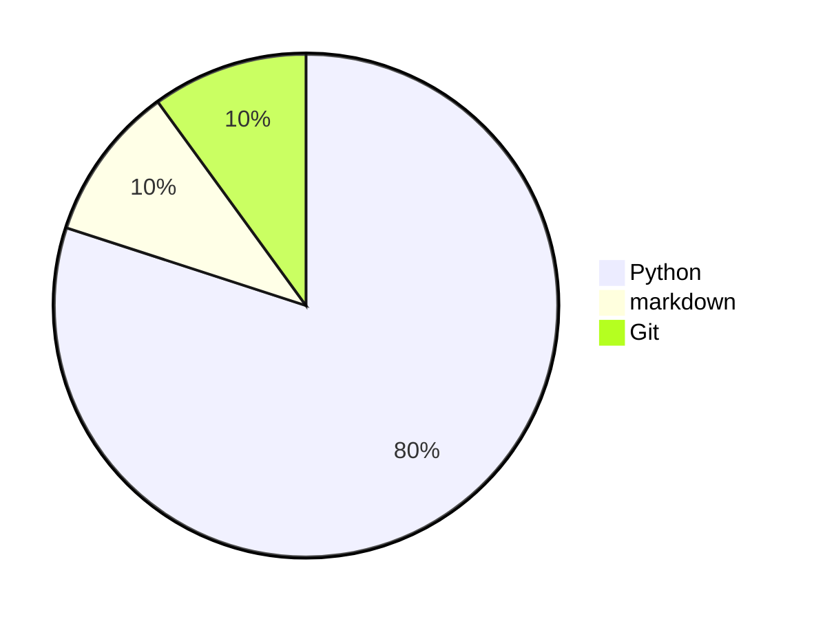
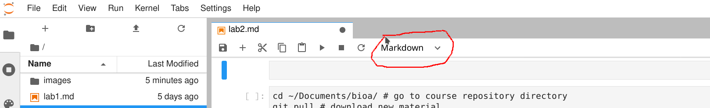

# Introduction to GIT

---
>> **TASK**
>>
>> - Clone course data
>>

---

To get this document and all the other files in the repository we will download it from the web with GIT.

First we need to select directory where we want all the files to be... 

For simplicity lets select default Documents folder in home directory.

Open terminal go to ~/Documents/ and clone the repository.


```bash
cd ~/Documents/
git clone https://aaleks@bitbucket.org/aaleks/bioa.git
```

---
>> **TASK**
>>
>> - Install Anaconda
>>

---

Change the terminal working directory to ~/Downloads/ and download Anaconda using `curl` command. Then change its permissions to have execution rights and run it. Read installation prompt and when asked type `yes` to continue installation process.

```bash

cd ~/Downloads/

curl -o Anaconda.sh https://repo.anaconda.com/archive/Anaconda3-2019.10-Linux-x86_64.sh

chmod u+x Anaconda.sh

./Anaconda3-2019.07-Linux-x86_64.sh

```

---
>> **TASK**
>>
>> - Run JupyterLab and open this document using it
>>

---

It is best to launch JupyterLab in the root directory of the project.

For this course the root directory is in ~/Documents/bioa/ (if you cloned it there in the previuos step)

```bash
cd ~/Documents/bioa/

jupyter lab
```

Jupyter will start and the terminal will be occupied.  To stop jupyter press `C-c` and whene asked confirm by typing `yes`.

To execute other commands and interact with OS open new terminal. It is possible to launch terminal inside jupyterlab.

You can also start Jupyter lab or other editors from anaconda. It is the easiest way to launch it in Windows OS (Start->anaconda-navigator)

```bash
anconda-navigator
```


Explore basic JupyterLab commands: 

Help -> JupyterLab reference

Open this file in JupyterLab as notebook.



<!-- #region -->
## JupyterLab setup

- Enable extensions. Settings -> enable extension manager
- Install nodejs: `conda install nodejs`
- Install extensions, explore their documentation. `jupyterlab_variableinspector`, `jupyterlab-markup` and `jupyterlab/git`




- Explore keyboard shortcuts for jupyterlab control
<!-- #endregion -->

---
>> **TASK**
>>
>> - Create markdown file and write:
>>      * short bullet list of linux commands
>>      * short bullet list of git commands
>>      * add sections, images
>>
---

JupyterLab cells can be created in three types: Code, markdown and raw

To write markdown select markdown option. 



Markdown cheatsheet (quick command overview/tutorial) can be found here:
[here](https://github.com/adam-p/markdown-here/wiki/Markdown-Cheatsheet)

To learn markdown you can also explore this document!


# Create your repository


---
>> **TASK**
>>
>> - Create your repository
>> - Link to online repository
>> - Copy course material, personal files and synchronize
>>

---

- To create your own repository first create new personal directory in the ~/Documents/  and go to that directory.

- Configure git. `git config`. For detailed commands look into lecture pdf.

- Then initialize git repository inside your personal directory `git init`

- Explore the created folders and files. Check repository status. `git status`

- Create new files or copy from other directories and explore how that changes repository status. Start tracking files. `git add fileName`

- Commit them to repository and explore changes to repository status. `git commit -m 'message'`

- Create and edit .gitignore file.

- Create README file

- Select one of the websites for hosting your repository and follow their tutorial to upload yours to the cloud:

[github](https://guides.github.com/activities/hello-world/)

[bitbucket](https://www.atlassian.com/git/tutorials/learn-git-with-bitbucket-cloud)


# Summary of workflow for every lesson

```bash
cd ~/Documents/bioa/                  # go to course repository directory

git pull                              # download new material

cd myDirectory                        # go to your directory

git pull                              # download the work done at home

cp newStuff myDirectory               # copy course material to your directory

cd myDirectoryroot                    # go to your directory root folder

jupyter lab                           # run jupyter lab or other editor

# C-c to exit jupyter lab at the end of the lesson

git add -A                            # track your changes

git commit -m 'describe your changes'

git push                              # upload to cloud for work at home
```


# Summary of git commands

## Git Basics

```bash
git init                              # Initialize a repository

git status                            # Show status of working tree

git add file.txt                      # Start tracking file.txt

git add main.txt                      # Stage modified file main.txt

git diff                              # Show what's changed but not yet staged

git commit                            # Commit changes

git commit -a                         # Stage files and commit

git mv main.txt file.txt              # Rename main.txt to file.txt

git fetch develop                     # Pull data from remote 'develop' without merging

git pull origin develop               # Fetch and merge branch 'develop' from origin

git clone url                         # Create local copy of remote repository at 'url'
```

## Merging

```bash
git mergetool                         # Use graphical merge tool

git commit                            # Finalize merge after resolving conflicts

git merge feature1                    # Merge branch 'feature1' with current branch

git add file.txt                      # Mark file.txt as resolved after merge
```

## Remotes

```bash
git remote                            # Show remote servers you have configured

git remote -v                         # Show remote servers with URL displayed

git remote add myurl url              # Add remote server 'url' with shortname 'myurl'

git remote rename server1 server2     # Rename remote 'server1' to 'server2'

git remote rm server1                 # Remove remote 'server1'

git remote show origin                # Show info about remote origin
```

## Commit Logs

```bash
git log                               # Show commit logs

git log -p -2                         # Show last two commits with diffs

git log --stat                        # Show commit logs with stats

git log --pretty=oneline              # Show commit logs one per line

git log --graph                       # Show commit logs with ascii graph

git log --since=1.week                # Show commit log for the last week

git blame -L 10,15 file.rb            # Show prev commits for each lines 10-15 of file.rb

```

## Undo / Change History

```bash

git rm --cached main.txt              # Remove main.txt from staging but keep in working

git commit --amend                    # Replace last commit with whats in staging

git checkout -- file.txt              # Discard changes to file.txt

git reset HEAD file.txt               # Unstage file.txt

git commit --amend                    # Modify last commit message

git rebase -i HEAD~3                  # Make changes to the last 3 commits

```

## Branching

```bash
git branch                            # Show current branches

git push origin master                # Push master branch to origin server

git branch -v                         # Show last commit on all branches

git checkout master                   # Switch to branch 'master'

git branch feature1                   # Create new branch called 'feature1'

git checkout -b feature2              # Create branch 'feature2' and switch to it

git branch -d mybranch                # Delete branch 'mybranch'

git branch --merged                   # Show branches already merged into current branch

git branch --no-merged                # Show branches not yet merged into current branch

git branch -D fix                     # Force delete branch 'fix' that is not yet merged

git push origin feature1              # Push local branch 'feature1' to origin

git push staging develop:master       # Push develop branch to remote staging master

git checkout -b fix1 origin/fix1      # Create local branch 'fix1' based off origin branch

git checkout --track origin/fix2      # Create tracking branch 'fix2' based off origin

git push origin :fix2                 # Delete remote branch 'fix2' from origin
```

```bash

```
